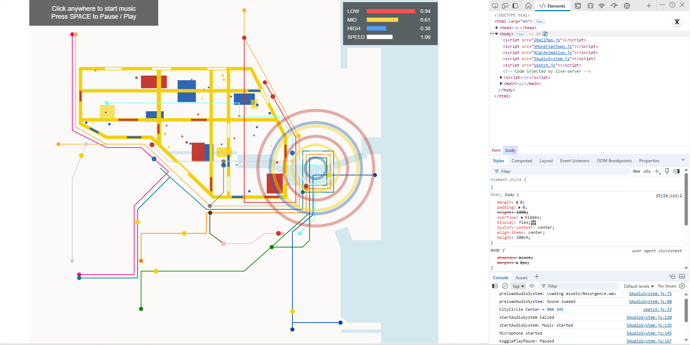

# IDEA9103_SydneyRailBroadway_Audio_HaohongLu
**Group |** USYD 2025 S2 IDEA9103 Jared Group C
<br> Haohong Lu 550639992 halu0669


### 1. Project Overview

This project is an interactive audio-reactive artwork built with p5.js, combining the structure of the Sydney train map with a Mondrian-inspired city layout. The entire scene reacts dynamically to both music playback and live microphone input, allowing sound to directly influence movement, color, and visual energy across the composition.

The work focuses on building an major audio-driven animation system that analyzes frequency bands in real time and injects motion into specific parts of the city. The goal is to treat the city as a living system where rhythm and behavior emerge from sound.

The music comes from my own production which may basically fit the energy of the city, so there won't be any copyright probelms at all.

Link: <https://music.163.com/song?id=2021683435>



### 2. How to Interact

Click anywhere on the screen to begin.
This activates both audio playback and microphone input. <br> (Required due to modern browser audio policies)

Music will start playing and the animation begins responding instantly. Car movement speeds up when bass energy increases. Rail colors brighten as mid frequencies rise. High frequencies create motion among small particles within the Mondrian town area.

Make a short sound (hand clap, finger snap, etc.) near a microphone to generate a ripple. Waves expand outward from the center of the City Circle by Mondrian colors.

**If the browser blocks audio:**

Check the “Allow microphone” permissionor reload the page and click again.

Everything happens automatically once the system is activated, and the city will transform with sound.

### 3. Individual Animation Approach

Chosen method --> Audio-driven animation (FFT + microphone input)

My work animates the city by assigning four different sound parameters to four different visual behaviors. Each parameter drives a distinct layer of the scene.

(1) Low Frequency (20–250 Hz) --> **Car Speed** --> 4Caranimation.js

The system measures changes in bass energy between frames. Sudden increases represent rhythmic impulses, which accelerate the cars that travel along train lines.

This makes the transportation network feel alive, like the pulse of a city reacting to its own internal momentum.

```javascript
audioLow = lerp(audioLow, rawLow, 0.5);
audioSpeedFactor = minSpeed + diffNorm * (maxSpeed - minSpeed);
```

(2) Mid Frequency (250–2000 Hz) --> **Rail Brightness** --> 2RaimMap.js

Mid frequencies contain the core presence of music—melodies, vocals, and the main harmonic body.
This band is maaped to the brightness of the rail lines, making the Sydney train network subtly glow and shimmer in response to the music.

When the mid band rises, the rails become noticeably lighter, creating a gentle pulse across the map.
This visual change represents how cultural energy and social activity travel through a city’s infrastructure, brightening and fading like a rhythmic flow of movement and attention.

```javascript
let brightnessAmount = pow(audioMid, 1.1) * 0.9;
brightnessAmount = constrain(brightnessAmount, 0, 1);

let mappedColor = lerpColor(baseColorObj, color(255), brightnessAmount);
```

(3) High Frequency (2000–10000 Hz) --> **Town Particles** --> 3MondrianTown.js

High frequencies feel sharp and detailed.
To express that shift, a particle system is created inside the Mondrian Town.

Particles move faster when treble energy increases. They bounce off the outline and change color on impact. Movement is random but guided by a speed scale from the FFT. This gives the town an internal sense of activity and spontaneity.

```javascript
let speedScale = baseSpeedScale + audioFactor * 2.0;
```

(4) Microphone Input --> Ripple Waves --> 5AudioSystem

Quick changes in microphone volume generate outward waves centered from the City Circle. Each ripple chooses a Mondrian color, expands, fades, and disappears at full transparency

The ripple tries to represent external disturbed moments when the city reacts not to its own rhythm but to outside forces.

```javascript
micRipples.push({
  x: cityCircleCenterX,
  y: cityCircleCenterY,
  radius: 0,
  alpha: 120,
  thickness: 3 + strength * 3,
  growth: 3 + strength * 15,
  baseColor: chosenColor
});
```

### 4. Concept and Inspiration

(1) The structure of the grid and the use of red, blue, yellow, and white form the visual foundation of the piece.
These colors became symbolic energy markers throughout the animation.

(2) As people move faster and become busier, awareness of underlying city systems ,like rail networks, routines, invisible infrastructure, gradually fades. We often forget and lose the ability of perceiving somthing.

Mapping frequency bands into different behaviors allowed me to express this idea through movement.

    Low frequencies --> Structural Rhythm (Behavior)

    Mid frequencies --> Cultural Activity (System)

    High frequencies --> Rapid Movements (Interior Life)

    Microphone ripple --> Sudden Disruptions (Outside World)

Together, they turn the map into a metaphor for how cities breathe and react with human presence.

(3) The piece also explores the tension between order and chaos. The Mondrian grid suggests structure and control, but the audio-driven motion gradually disturbs that stability. Cars accelerate unpredictably, town particles bounce and change color, rail brightness flickers, and microphone ripples cut across the entire map.

This contrast reflects how real cities constantly balance planned systems with spontaneous human behavior, which is actually pretty intersting somehow.

### 5. Technical Explanation

The work is implemented through 5AudioSystem.js.

(1) FFT Analysis

A p5.FFT analyzer is created in setup.

```javascript
trackFFT = new p5.FFT(0.9, 1024);
```

Three frequency bands are extracted each frame.

```javascript
rawLow  = map(trackFFT.getEnergy(20, 250),   0, 255, 0, 1);
rawMid  = map(trackFFT.getEnergy(250, 2000), 0, 255, 0, 1);
rawHigh = map(trackFFT.getEnergy(2000,10000),0, 255, 0, 1);
```

(2) Speed Factor from Bass

To capture movement instead of raw volume, the difference between frames is computed.

```javascript
let diff = abs(rawLow - audioLow);
diffNorm = map(diff, 0.0, 0.05, 0, 1);
```

This avoids jittering and creates smoother, perceptual motion.

(3) Microphone Detection

A rising edge microphone detector triggers ripples.

```javascript
let micDiff = rawMic - micFollow;
if (micDiff > micThreshold) spawnMicRipple(strength);
```

(4) Ripple Animation

Each ripple grows and fades over time.

```javascript
ripple.radius += ripple.growth;
ripple.alpha  -= 2;
```

Used low alpha fade and Mondrian colors to maintain visual consistency.

(5) Integration with sketch.js

updateAudioSystem() is called once per frame, while
drawMicRipples() is drawn after the map and city layers.

```javascript
function draw() {

  // 0) Update audio every frame

  push();
  ...
  push();
  // 1) Background
  // 2) Mondrian Town
  // 3) Rails & Stations
     // Ripple Waves
  // 4) Car Animation
  pop();
  // 5) UI Overlays
  pop();
}
```

This separates logic and rendering, keeping the whole process clean.

### References

Baumgartner, L. (n.d.). p5.js Sound Examples. GitHub. <br> <https://github.com/processing/p5.js-sound/tree/main/examples>

Lu, H. (2023). Resurgence. NetEase Cloud Music. <br> <https://music.163.com/song?id=2021683435>

NSW Transport. (n.d.). Sydney Trains Network Map. <br> <https://transportnsw.info/routes/train>

OpenAI. (2025). ChatGPT. <br> <https://chat.openai.com/>  
(Used for debugging, code explanation, audio-reactive logic refinement, and clarifying JavaScript behavior)

Processing Foundation. (n.d.). p5.sound reference. <br> <https://p5js.org/reference/#/libraries/p5.sound>  
(Used for FFT, amplitude, microphone input, and so on...)

Shiffman, D. (2015). Particle systems in JavaScript. The Coding Train. <br> <https://www.youtube.com/watch?v=UcdIGEy0RT8>

Shiffman, D. (2016). Sound amplitude analysis in p5.js. The Coding Train. <br> <https://www.youtube.com/watch?v=NCCHQwNAN6Y>

Shiffman, D. (2017). Fourier transform (FFT) in p5.js. The Coding Train. <br> <https://www.youtube.com/watch?v=2O3nm0Nvbi4>

The Art Story. (n.d.). Piet Mondrian: Dutch painter. <br> <https://www.theartstory.org/artist/mondrian-piet>

Woo Snyder, B. L. (2023). P5.Sound Crash Course: JavaScript for Sound Artists. WebSoundArt. <br> <https://websoundart.org/articles/20231217_tutorial-6-p5sound>

### Thank You :)
